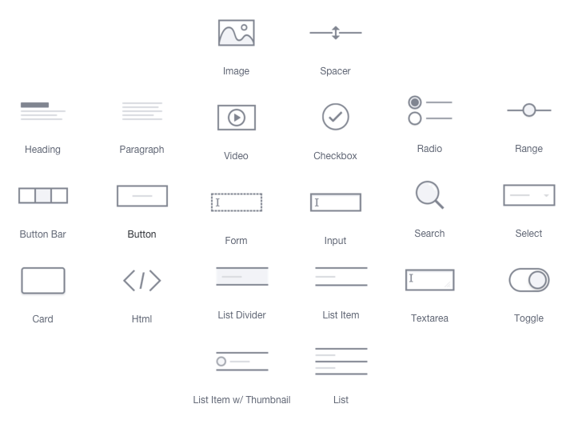
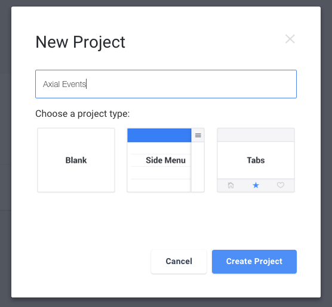
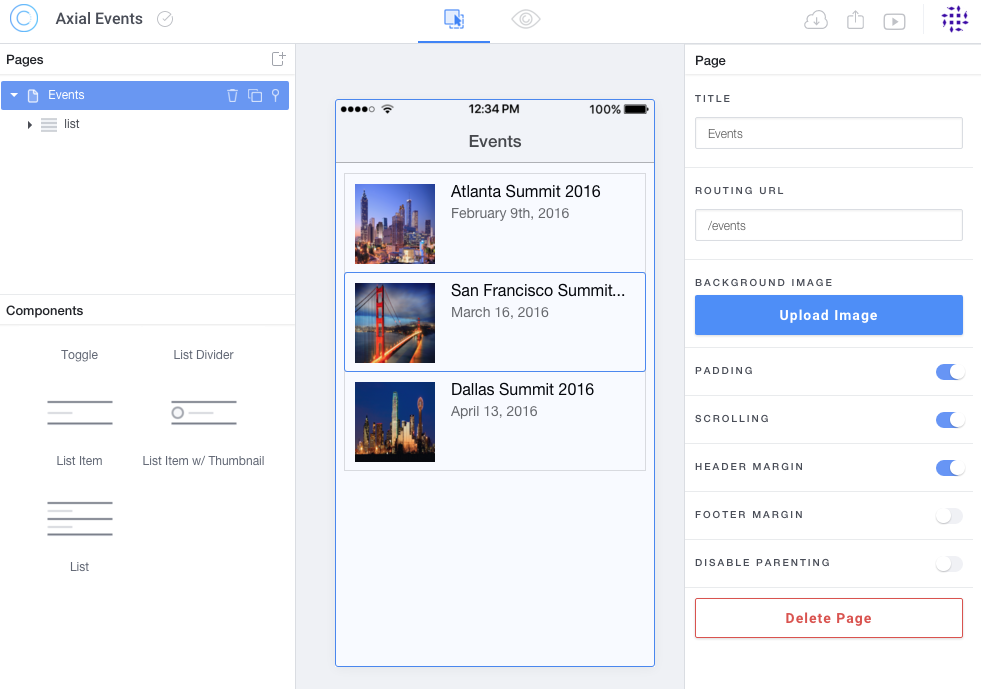
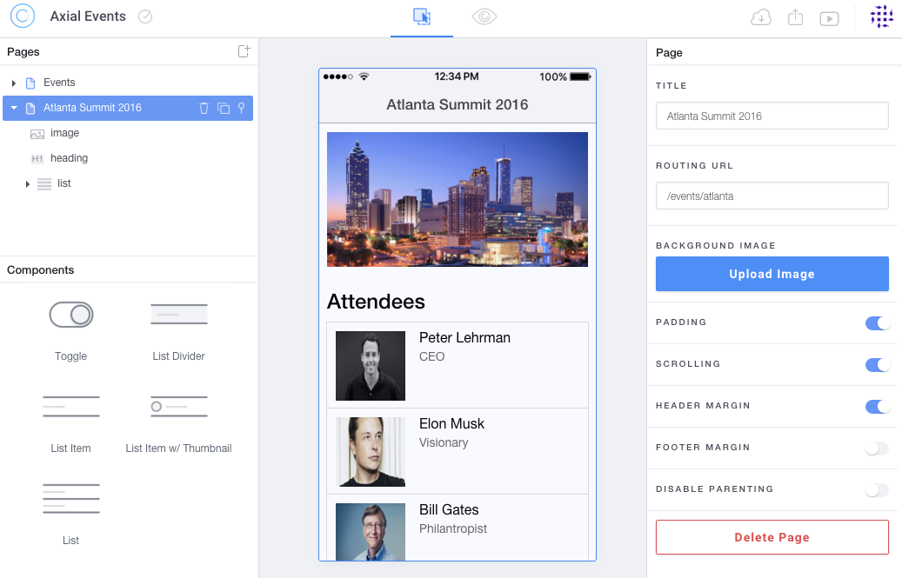
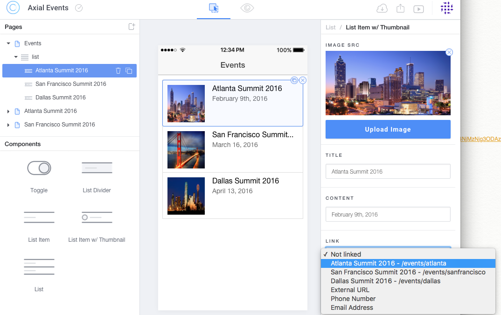
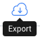

## Ionic Creator - From idea, to prototype, to real life app ##

The [Ionic](http://ionic.io) team has been hard at work trying to lower the barrier 
of entry in the mobile development world.

The [Ionic Creator](http://usecreator.com) is a simple prototyping tool that helps 
developers, designers, and project managers to quickly build mobile apps and websites 
without having to code.

This allows for a quick feedback loop among a team which helps speed up the development
process drastically. A project manager might prototype a design and generate real, 
clean Ionic code to give to a developer. Or, a developer might use Creator to quickly 
generate UI snippets and rapidly bootstrap new app projects.

Unfortunately, as of now, dynamic data prototyping is not directly supported into the 
tool and this tutorial aims at highlighting how this can be done.

### What is Creator ###

As [Matt Kremer](https://mattkremer.com/) puts it in the [very first Ionic Creator tutorial video](https://youtu.be/lTLTs2ZA2JQ?list=PLOMESIqyrpf-rpNjFGzuCoTwNdv_-PUD1):
>“Ionic Creator is a simple drag and drop prototyping tool to create real app with the touch of your mouse.”

Indeed, Ionic Creator is provides a full set of Ionic components that you can simply 
drag and drop into your project and rapidly prototype a fully working app.



### Who is Ionic Creator for? ###

+ **Novice Developers** trying to get their hand in hybrid mobile development
+ **Designers** tweaking around options for product development
+ **Experienced Ionic developers** looking to bootstrap their projects
+ **Freelance developers** gathering clients feedback via sharing features

### Collaborate, Share and Export your App ###

Ionic Creator makes it simple to [collaborate](https://creator.ionic.io/app/dashboard/groups) 
and share your app in many ways.

You can send a link to the app running into the browser via URL, Email or SMS so
user can run the app from the browser. 

Using the Creator App ([Android](https://play.google.com/store/apps/details?id=io.ionic.creator), 
[iOS](https://itunes.apple.com/us/app/ionic-creator/id1055373342)) you can share the app
and have it run directly on the device in the similar conditions as if it was a stand alone app.

Finally, you can package your app for iOS and/or Android directly through the 
[Ionic Package](http://blog.ionic.io/build-apps-in-minutes-with-ionic-package/) service.

### Introducing Axial Events! ###

The goal of the app is to show a list of events and allow the member to indicate which other 
attendee to meet up with so that we can send reminders during the event.

We will need:

+ **List of Events**: title, content, image
+ **Event Detail page**: list of attendees with a way to indicate interest

### Step 1: Project Creation ###

First we will pick a blank project as we do not need a side menu or a tab layout.



### Step 2: Create the list of Events ###

Then, let's rename the new page as Events, drag in some `List Item w/ Thumbnail` 
and give each of them some details.



### Step 3: Create Event details page ###

For each event, we will need to create a detail page which we will name according 
to the event and add a list of `List Item w/ Thumbnail` for the attendees:



### Step 4: link everything together! ###

Finally, for each item in our events list, let's adust the link to their respective
target page:



### Step 5: let’s take it out in the wild! ###

At this point, we got an app that showcase how the flow will go from screen to screen. 
Let’s take it live and plug it to our API. It's time to export our app.



Once you open the repository in your favorite text editor, everything has been wired up together for you. 
With a little of Angular knowledge, and a dash of CSS, the sky is the limit!

Let's clean up the code a bit and plug in our API.

### Step 6: Cleanup - Views - Events ###

First let's clean up the Events List view and make use of repeating element:

```html
  <ion-view title="Events">
    <ion-content overflow-scroll="true" padding="true" class="has-header">
        <ion-list>
            <ion-item class="item-thumbnail-left" ui-sref="atlantaSummit2016">
                
                <h2>Atlanta Summit 2016</h2>
                <p>February 9th, 2016</p>
            </ion-item>
            <ion-item class="item-thumbnail-left" ui-sref="sanFranciscoSummit2016">
                
                <h2>San Francisco Summit 2016</h2>
                <p>March 16, 2016</p>
            </ion-item>
            <ion-item class="item-thumbnail-left" ui-sref="dallasSummit2016">
                
                <h2>Dallas Summit 2016</h2>
                <p>April 13, 2016</p>
            </ion-item>
        </ion-list>
    </ion-content>
  </ion-view>
```

then becomes:

```html
  <ion-view title="Events">
    <ion-content overflow-scroll="true" padding="true" class="has-header">
        <ion-list>
            <ion-item class="item-thumbnail-left" ng-repeat="event in events" ui-sref="event({id:event.id})">
                
                <h2>{{::event.title}}</h2>
                <p>{{::event.date}}</p>
            </ion-item>
        </ion-list>
    </ion-content>
  </ion-view>
```

### Step 6: Cleanup - Views - Event Info ###

When duplicating the Event Details page, we created three identical page which should really be one template instead. Therefore, `atlantaSummit2016.html`, `dallasSummit2016.html` and `sanFranciscoSummit2016.html` are replaced by 
one `event.html` file which ressembles:

```HTML
  <ion-view title="{{::event.title}}">
    <ion-content overflow-scroll="true" padding="true" class="has-header">
        <div style="text-align:center;">
            
        </div>
        <h3>Attendees</h3>
        <ion-list>
            <ion-item ng-repeat="attendee in event.attendees" class="item-thumbnail-left">
                
                <h2>{{::attendee.name}}</h2>
                <p>{{::attendee.title}}</p>
            </ion-item>
        </ion-list>
    </ion-content>
  </ion-view>
```

### Step 6: Cleanup - Routes ###

Since we have removed the duplicated views, we need to clean up the `routes.js` file a little from this:

```javascript
  $stateProvider
    .state('events', {
      url: '/events',
      templateUrl: 'templates/events.html',
      controller: 'eventsCtrl'
    })
    .state('atlantaSummit2016', {
      url: '/events/atlanta',
      templateUrl: 'templates/atlantaSummit2016.html',
      controller: 'atlantaSummit2016Ctrl'
    })
    .state('sanFranciscoSummit2016', {
      url: '/events/sanfrancisco',
      templateUrl: 'templates/sanFranciscoSummit2016.html',
      controller: 'sanFranciscoSummit2016Ctrl'
    })  
    .state('dallasSummit2016', {
      url: '/events/dallas',
      templateUrl: 'templates/dallasSummit2016.html',
      controller: 'dallasSummit2016Ctrl'
    });
```

to this:

```javascript
  $stateProvider
    .state('events', {
      url: '/events',
      templateUrl: 'templates/events.html',
      controller: 'eventsCtrl'
    })
    .state('event', {
      url: '/events/:id',
      templateUrl: 'templates/event.html',
      controller: 'eventCtrl'
    });
``` 

### Step 6: Adjust Controllers ###

Instead of one controller per event, we will need one `eventCtrl` controller

```javascript
  angular
    .module('app.controllers', [])
    .controller('eventsCtrl', function($scope) {
    })
    .controller('atlantaSummit2016Ctrl', function($scope) {
    })
    .controller('sanFranciscoSummit2016Ctrl', function($scope) {
    }) 
    .controller('dallasSummit2016Ctrl', function($scope) {
    })
```

then becomes:

```javascript
  angular
    .module('app.controllers', [])
    .controller('eventsCtrl', function($scope, EventsService) {
      $scope.events = [];
      EventsService.getEvents().then(function(res) {
        $scope.events = res;
      });
    })
    .controller('eventCtrl', function($scope, $stateParams, EventsService) {
      $scope.event = [];
      EventsService.getEventDetails($stateParams.id).then(function(res) {
        $scope.event = res;
        EventsService.getEventAttendees($stateParams.id).then(function(res) {
          $scope.event.attendees = res;
        });
      });
    })
```

### Step 6: Implement Services ###

First of all, we need to put together a quick API which will provide data manipulation layer for our app.

For the purpose of this demo, I put together a quick Express API running with nodeJS available [here](https://gist.github.com/xlozinguez/6a9a25653e0ae851f97f).

Given the API is now running at `http://localhost:3412/`, we have the following endpoints:

+ **GET** /events
+ **GET** /events/:id
+ **GET** /events/:id/attendees

Let's plug all those in our `EventsService`:

```javascript
  angular.module('app.services', [])

  .service('EventsService', ['$http',
    function($http) {
      return {
        getEvents: function() {
          var promise = $http.get('http://localhost:3412/events').then(function (response) {
            return response.data;
          }, function (response) {
            console.log(response);
          });
          return promise;
        },
        getEventDetails: function(id) {
          var promise = $http.get('http://localhost:3412/events/'+id).then(function (response) {
            return response.data;
          }, function (response) {
            console.log(response);
          });
          return promise;
        },
        getEventAttendees: function(id) {
          var promise = $http.get('http://localhost:3412/events/'+id+'/attendees').then(function (response) {
            return response.data;
          }, function (response) {
            console.log(response);
          });
          return promise;
        }
      }
    }
  ]);
```

### Step 7: Serve! ###

At this point, we got our app connected to a working API and we are ready to publish!

**Display the app in a browser with android and iOS version side by side**
```
  $ ionic serve --lab
```
**Build and run the app in iOS simulator**
```
  $ ionic build ios && ionic run ios
```
**Build and run the app in android simulator**
```
  $ ionic build android && ionic run android
```
**Package your app for store publication via Ionic package**
```
  $ ionic package build ios --profile dev
```

### Ressources ###

+ **Ionic Framework** - [http://ionicframework.com/](http://ionicframework.com/)
+ **Ionic Services** - [http://ionic.io/](http://ionic.io/)
+ **Ionic Creator** - [http://usecreator.com](http://usecreator.com)
+ **[Ionic Creator Tutorial Videos on Youtube](https://www.youtube.com/playlist?list=PLOMESIqyrpf-rpNjFGzuCoTwNdv_-PUD1)**
+ **Ionic Package** - [http://blog.ionic.io/build-apps-in-minutes-with-ionic-package/](http://blog.ionic.io/build-apps-in-minutes-with-ionic-package/)
+ **Find help on Slack** - [http://ionicworldwide.herokuapp.com/](http://ionicworldwide.herokuapp.com/)